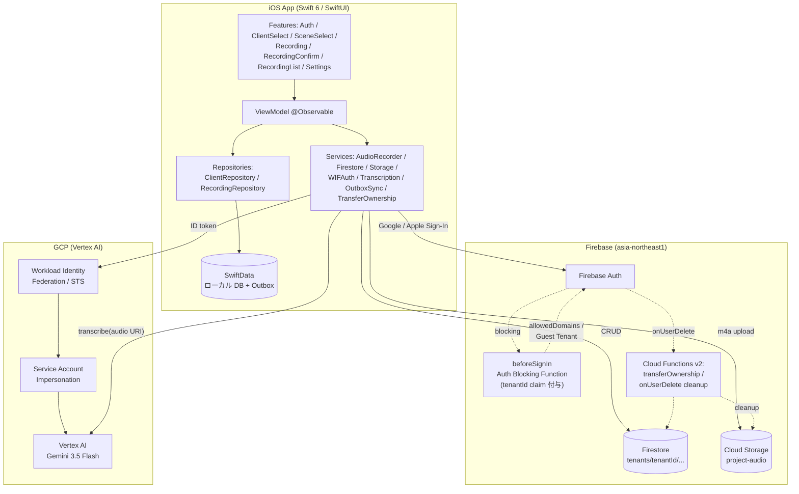
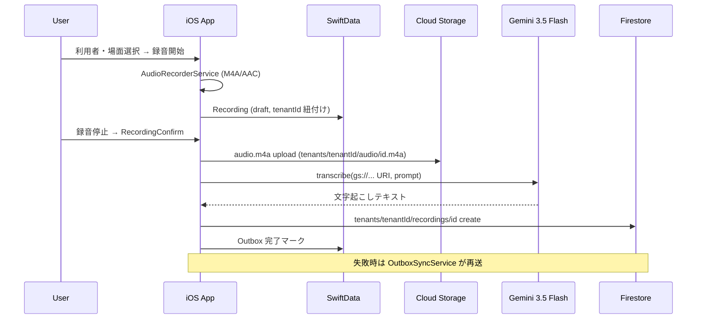
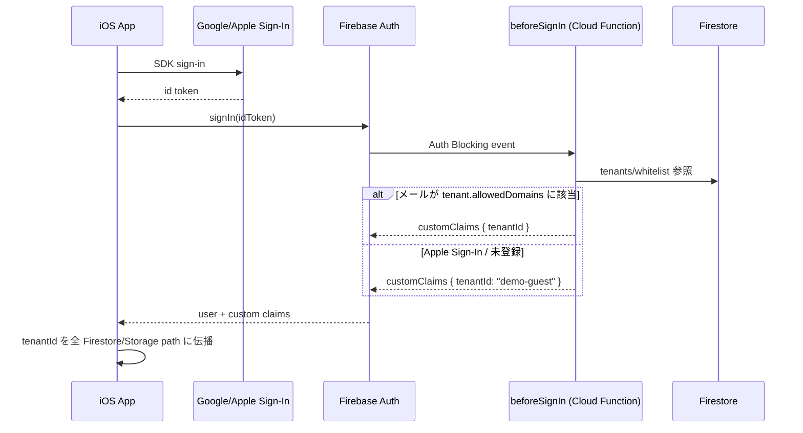

# CareNote

ケアマネジャー向け録音・文字起こし iOS アプリ。Google Sign-In → Firebase Auth → Vertex AI Gemini による多テナント設計で、訪問記録の作成を音声主体に置き換える。

**Status**: v1.0.1 App Store Connect Unlisted 配信中（2026-04-27 〜、Build 38 / iOS 17+）

- [Quickstart](#quickstart) — ローカル起動 4 ステップ
- [アーキテクチャ](#アーキテクチャ) — サービス構成 / データフロー / 認証フロー
- [AI 向けアーキテクチャ引き継ぎ](#ai-向けアーキテクチャ引き継ぎ) — Claude Code / Codex 等の初回コンテキスト
- [設計判断 (ADR)](#設計判断-adr) / [運用 Runbook](#運用-runbook)

## Quickstart

```bash
git clone https://github.com/system-279/carenote-ios.git
cd carenote-ios
xcodegen generate                          # project.yml → CareNote.xcodeproj
# CareNote/GoogleService-Info.plist を配置（Firebase Console → carenote-dev-279）
open CareNote.xcodeproj                    # Xcode 26.3+ で開いて実行
```

CLI ビルド:

```bash
DEVELOPER_DIR=/Applications/Xcode.app/Contents/Developer \
  xcodebuild build -project CareNote.xcodeproj -scheme CareNote \
  -destination 'platform=iOS Simulator,name=iPhone 17 Pro' CODE_SIGNING_ALLOWED=NO
```

Xcode 操作は **XcodeBuildMCP 経由**（`mcp__xcodebuildmcp__build_sim_name_proj` 他）。TestFlight upload は `./scripts/upload-testflight.sh`。

## 技術スタック

| カテゴリ | 技術 |
|---------|------|
| 言語 / UI | Swift 6+ / SwiftUI |
| アーキテクチャ | MVVM + Repository（`@Observable`）、`async/await` + `actor` |
| ローカル DB | SwiftData（Repository 経由、View で `@Query` 直接禁止） |
| Package Manager | Swift Package Manager |
| 認証 | Firebase Auth + Google Sign-In / Apple Sign-In、Auth Blocking Function |
| バックエンド | Firestore（multi-tenant）、Cloud Storage、Cloud Functions v2 (Node 22) |
| 文字起こし | Vertex AI Gemini 3.5 Flash（`gemini-3.5-flash`、asia-northeast1、`thinkingLevel=minimal`）|
| GCP 認証 | Workload Identity Federation → Service Account Impersonation |
| 録音 | AVAudioRecorder（M4A/AAC、44.1kHz、mono、high quality） |
| テスト | Swift Testing (`@Test`, `#expect`) / Mocha (functions) |

## アーキテクチャ

### システム構成



### 録音〜文字起こしデータフロー



### 認証・多テナント



**Multi-tenant 原則**:

- Firestore パス: `tenants/{tenantId}/{clients|recordings|templates|...}`
- Storage パス: `{project}-audio/tenants/{tenantId}/audio/{recordingId}.m4a`
- `tenantId` は Firebase Auth custom claim から取得（**ハードコーディング禁止**）
- Security Rules: テナントメンバー限定（ADR-010）

## ディレクトリ構成

```
carenote-ios/
├── CareNote/                    # iOS アプリ本体
│   ├── App/                     # @main (CareNoteApp), AppConfig
│   ├── Features/                # 画面別モジュール (View + ViewModel)
│   │   ├── Auth/                # Google/Apple Sign-In
│   │   ├── ClientSelect/        # 利用者選択
│   │   ├── SceneSelect/         # 場面（訪問/電話 等）選択
│   │   ├── Recording/           # 録音画面
│   │   ├── RecordingConfirm/    # 録音確定 → 文字起こし
│   │   ├── RecordingList/       # 履歴一覧
│   │   └── Settings/            # 設定・アカウント移行
│   ├── Services/                # ビジネスロジック (async/await + actor)
│   │   ├── AudioRecorderService, TranscriptionService, StorageService
│   │   ├── FirestoreService, WIFAuthService, ClientCacheService
│   │   └── OutboxSyncService, TransferOwnershipService, LocalDataCleaner
│   ├── Repositories/            # SwiftData 抽象化層
│   ├── Models/                  # SwiftData @Model, Firestore Codable, Enum
│   ├── Infrastructure/          # AppEnvironment, KeychainHelper, TimeFormatting
│   ├── Components/              # 再利用 SwiftUI View
│   └── Firebase/                # dev/prod GoogleService-Info.plist (.gitignore)
├── CareNoteTests/               # Swift Testing (20+ test files)
├── functions/                   # Cloud Functions v2 (Node 22)
│   ├── index.js                 # beforeSignIn (Auth Blocking), transferOwnership 等
│   ├── src/transferOwnership.js
│   └── test/                    # Mocha (rules test + auth blocking test)
├── firestore.rules              # Multi-tenant security rules (ADR-010)
├── storage.rules
├── project.yml                  # XcodeGen 定義
├── scripts/
│   ├── upload-testflight.sh     # ビルド番号自動インクリメント + Archive + upload
│   └── set-tenant-claim.sh      # 手動 tenant 割り当て
├── docs/
│   ├── adr/                     # 設計判断 (ADR-001 〜 011)
│   ├── runbook/                 # 運用手順
│   └── handoff/                 # セッション履歴 (LATEST.md + archive/)
└── CLAUDE.md                    # AI 駆動開発の前提コンテキスト
```

## AI 向けアーキテクチャ引き継ぎ

Claude Code / Codex 等の LLM に本プロジェクトのアーキテクチャを引き継ぐ場合、以下を **この順** で読み込むと 5-10 分で全体像が掴める。

1. **[CLAUDE.md](CLAUDE.md)** — Claude Code グローバル前提（XcodeBuildMCP 使用ルール / 命名規約 / dev-prod 分離ルール / 禁止事項）
2. **本 README のアーキテクチャセクション** — システム構成 3 図（システム / データフロー / 認証）
3. **[ADR 全 11 件](docs/adr/)** — 主要設計判断の Why（下記索引）
4. **[docs/handoff/LATEST.md](docs/handoff/LATEST.md)** — 直近セッションの進捗・未解決 Issue・条件待ちタスク
5. **[docs/runbook/](docs/runbook/)** — 運用手順（prod 反映、admin ID token、smoke test）
6. **具体ソース**: `CareNote/Services/` → `CareNote/Features/` → `functions/index.js` の順に読めば実装マップが完成する

> [!IMPORTANT]
> セッション開始時は `/catchup` を実行するとハンドオフ状態・環境設定・積み残し Issue を自動集約する。

### 設計判断 (ADR)

| # | 決定 | 影響レイヤー |
|---|-----|-------------|
| [001](docs/adr/ADR-001-google-sign-in.md) | Google Sign-In 採用（Apple ID は Guest Tenant 経由） | Auth |
| [002](docs/adr/ADR-002-wif-auth-flow.md) | WIF 経由で GCP アクセストークン取得（SA key 同梱禁止） | Auth / GCP |
| [003](docs/adr/ADR-003-gemini-transcription.md) | 文字起こしは Gemini 2.5 Flash（`thinkingBudget=0` 固定、[011](docs/adr/ADR-011-gemini-3-5-flash-migration.md)で置換） | Transcription |
| [004](docs/adr/ADR-004-m4a-recording-format.md) | 録音は M4A/AAC 44.1kHz mono | Recording |
| [005](docs/adr/ADR-005-auth-blocking-function.md) | `beforeSignIn` で tenantId custom claim 付与 | Auth / Backend |
| [006](docs/adr/ADR-006-tenant-shared-templates.md) | テンプレート 2 層管理（テナント共有 + ユーザー個別） | Data model |
| [007](docs/adr/ADR-007-guest-tenant-for-apple-signin.md) | Apple Sign-In は `demo-guest` テナントへ自動プロビジョニング | Auth |
| [008](docs/adr/ADR-008-account-ownership-transfer.md) | アカウント所有権移行（Phase 0 + Phase 1 実装） | Callable Function |
| [009](docs/adr/ADR-009-prod-firestore-write-access.md) | prod Firestore 書き込みは workflow 経由（監査証跡） | Ops |
| [010](docs/adr/ADR-010-recordings-permission-model.md) | recordings Rules 権限モデル段階的強化 | Security Rules |
| [011](docs/adr/ADR-011-gemini-3-5-flash-migration.md) | Gemini 2.5 Flash discontinue に伴い Gemini 3.5 Flash へ移行（`thinkingLevel=minimal`） | Transcription |
| [012](docs/adr/ADR-012-vertex-ai-config-firestore.md) | Vertex AI モデル設定を Firestore 化（`platformConfig/vertexAi`、[014](docs/adr/ADR-014-vertex-ai-model-denylist.md)でmodelId検証方式を改訂） | Transcription / Config |
| [013](docs/adr/ADR-013-github-actions-wif-firestore-ops.md) | GitHub Actions + WIF による Firestore rules/操作デプロイ基盤（dev環境実装済、prod は Issue #178） | Ops / CI |
| [014](docs/adr/ADR-014-vertex-ai-model-denylist.md) | modelId検証を完全一致allowlistからProhibited denylistへ改訂（アプリ再ビルドなしで新モデルへ切替可能に） | Transcription / Config |

### 運用 Runbook

- [Phase 0.9 allowedDomains](docs/runbook/phase-0-9-allowed-domains.md) — `279279.net` 自動参加設定（prod 反映済、実機確認待ち）
- [Phase 1 admin ID token](docs/runbook/phase-1-admin-id-token.md) — Callable Function を admin 権限で叩く手順
- [Prod deploy smoke test](docs/runbook/prod-deploy-smoke-test.md) — Rules / Functions / Runtime 統合確認

## Coding Standards

- **Concurrency**: `async/await` + `actor`。`@Observable`（`ObservableObject` / `@Published` は使わない）
- **DB access**: 全て Repository 経由。`View` に `@Query` 直接使用禁止
- **Multi-tenant**: `tenantId` はハードコーディング禁止、パラメータで受け取る
- **Testing**: Swift Testing (`@Test`, `#expect`)、境界値と異常系必須。Partial Update 関数は「更新対象外フィールドの値が変化しないこと」をテスト
- **Xcode 操作**: 全て XcodeBuildMCP 経由

詳細は [CLAUDE.md](CLAUDE.md) 参照。

## 禁止事項

- `tenantId` のハードコーディング
- Service Account key (JSON) のアプリ同梱
- 音声ファイルの Firestore 保存（必ず Cloud Storage を使う）
- `thinkingLevel` を `minimal` 以外に設定
- Gemini 3 Flash / Preview モデルの使用
- `@Query` の View 直接使用
- prod GCP プロジェクト（`carenote-prod-279`）への読み書きをユーザー確認なしで実行

## GCP プロジェクト

| 環境 | プロジェクト ID | プロジェクト番号 | 切替方法 |
|------|----------------|-----------------|--------|
| Dev | `carenote-dev-279` | `444137368705` | `.envrc` で自動 active |
| Prod | `carenote-prod-279` | `781674225072` | `CLOUDSDK_ACTIVE_CONFIG_NAME=carenote-prod <cmd>` |

GCP アカウント: `system@279279.net`（dev/prod 共通、操作時は project 明示必須）
GitHub アカウント: `system-279`
Apple Team ID: `C96A7EHVW8` / Bundle ID: `jp.carenote.app` / App Store Connect 表示名: **CareNote AI**

## Testing

```bash
# iOS Unit Tests (Swift Testing)
mcp__xcodebuildmcp__test_sim_name_proj  # 推奨: XcodeBuildMCP 経由

# Cloud Functions Tests (Mocha)
cd functions && npm test                 # 全テスト
npm run test:rules                       # Firestore Rules のみ
npm run test:auth                        # beforeSignIn のみ
```

## Deploy

- **TestFlight**: `./scripts/upload-testflight.sh`（ビルド番号自動 inc + XcodeGen + Archive + upload）
- **Cloud Functions dev**: `firebase deploy --only functions -P default`
- **Cloud Functions prod**: `firebase deploy --only functions -P prod`
- **Firestore Rules prod**: workflow 経由（[ADR-009](docs/adr/ADR-009-prod-firestore-write-access.md) の 2 段承認）

## License

Private
