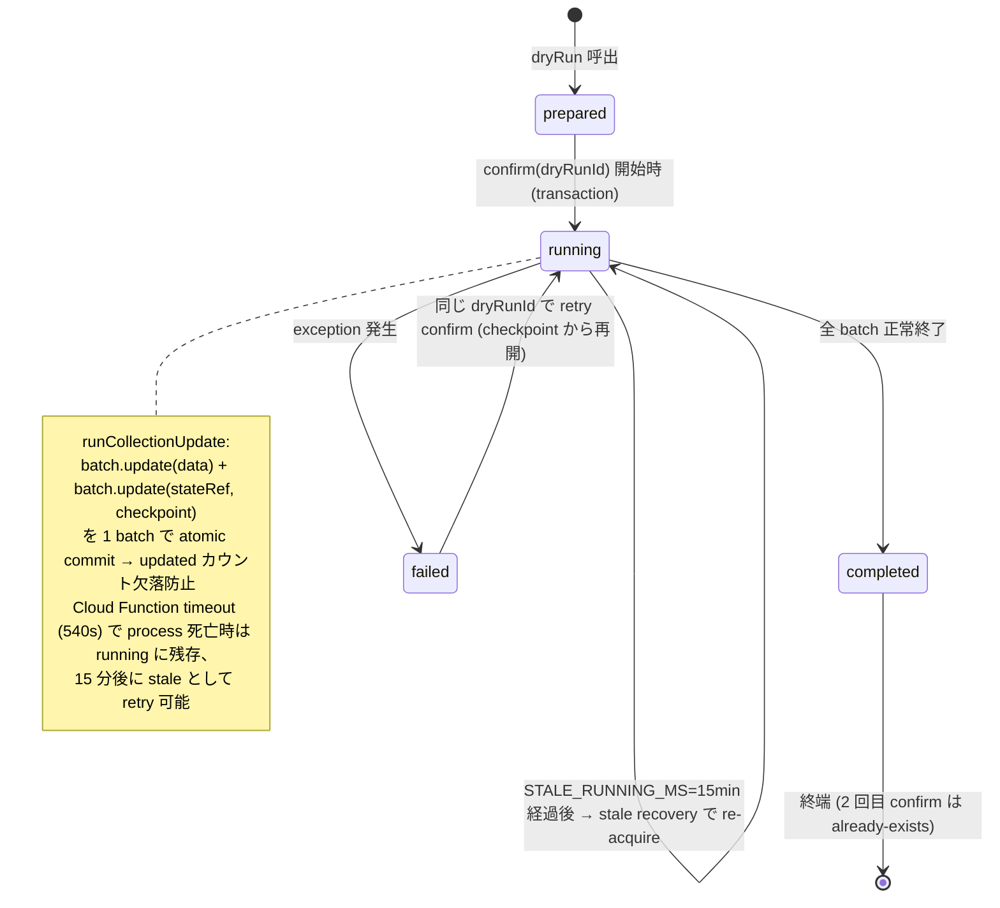

# ADR-008: アカウント所有権移行方式（Phase 0 + Phase 1 実装詳細）

**Status**: Accepted（Phase 1 実装着手、2026-04-21）
**Date**: 2026-04-20（Phase 0）／ 2026-04-21（Phase 1 追記）
**Supersedes**: なし
**Related**: Issue #99（PR #101, #112, #117 解消）、Issue #100（PR #115）、Issue #110（Phase 1 本体）

## Context

ユーザー改姓（例: `tanaka@279279.net` → `itou@279279.net`）等でメールごと Firebase Auth のアカウントが新規作成され uid が変わるケースで、過去の録音データを完全に新 uid に引き継ぐ機能が必要。

Firebase Auth Account Linking は同一 provider の異なるメールアカウント間で uid を保持できない（`credentialAlreadyInUse`）ため、「データ所有権移行」方式で対応する。

## Phase 0 調査結果: uid 参照箇所マップ

Explore エージェントによるコードベース全域棚卸しの結果。

### Firestore フィールド（書換対象）

| コレクション | フィールド | 型 | 用途 | 移行時の扱い |
|---|---|---|---|---|
| `tenants/{tid}/recordings/{rid}` | `createdBy` | string | 作成者 uid | **書換必要** |
| `tenants/{tid}/templates/{tid}` | `createdBy` | string | テンプレート作成者 uid | **書換必要** |
| `tenants/{tid}/whitelist/{eid}` | `addedBy` | string | whitelist エントリ追加者 uid | **書換必要**（監査追跡） |

### Firestore フィールド（不変）

| フィールド | 理由 |
|---|---|
| `templates.createdByName` | 意図的スナップショット（当時の表示名を保持） |
| `recordings.audioStoragePath` | gs:// URI、uid 非依存 |
| `tenants/{tid}` トップレベル | uid を含まない |
| `tenants/{tid}/clients/{cid}` | uid 参照なし |

### Cloud Storage

| path パターン | uid 含有 | 移行時の扱い |
|---|---|---|
| `{tenantId}/{recordingId}.m4a` | 含まない | **変更不要** |

Storage rules も uid 基準の ACL ではなく `request.auth.token.tenantId` のみなので、rules 変更も不要。

### iOS Swift コード（uid 取得点）

| ファイル | 参照種別 | 影響 |
|---|---|---|
| `AuthViewModel.swift` | `Auth.auth().currentUser?.uid` | uid 取得の中心。サインアウト/再ログインで自動更新 |
| `OutboxSyncService.swift` (PR #101 修正済) | `currentUidProvider()` を DI、`buildFirestoreRecording` で `createdBy` に設定 | **主経路**。空文字拒否ロジック有 |
| `RecordingConfirmViewModel.swift` (PR #101 修正済) | `{ Auth.auth().currentUser?.uid }` クロージャを渡す | 録音確定時の uid 提供 |
| `TemplateCreateViewModel.swift` | `userId` を init で受取、`createdBy` として渡す | テンプレート作成時の uid 固定 |
| `KeychainHelper.swift` | Apple authCode 保存（uid 自体ではない） | deleteAccount 時の revoke 用、uid 変動で stale 化するが best-effort |

### Cloud Functions (Node.js)

| ファイル:行 | 参照 | 影響 |
|---|---|---|
| `functions/index.js:115` | `request.auth?.uid` | deleteAccount の呼出元特定 |
| `functions/index.js:133` | `.where("createdBy", "==", uid)` | recordings フィルタ |
| `functions/index.js:167` | `admin.auth().deleteUser(uid)` | Firebase Auth user 削除 |

### uid 参照なし（確認済）

- FCM token
- Analytics userId / Crashlytics userId
- UserDefaults
- Cloud Storage metadata

## 対称性の崩れ（設計上の要注意点）

### 1. read は tenant 全件 / delete は uid フィルタ

- `fetchTemplates` / `fetchWhitelist` / `fetchRecordings` は tenant 内全件取得（uid フィルタなし）
- `deleteAccount` の recordings 削除は `createdBy == uid` でフィルタ
- **結果**: 移行前の古い uid で作成された templates / whitelist は、read は問題なく見えるが、移行忘れがあると `deleteAccount` では削除されない

### 2. templates / whitelist の orphan リスク

- `deleteAccount` は recordings のみ削除、templates / whitelist は残る
- 退職者が admin として追加した whitelist entry や template が、アカウント削除後も残存
- Issue #91（アカウント削除後のローカル SwiftData / Outbox クリーンアップ）と合わせて設計見直し必要

## 決定事項

### Phase 1 (transferOwnership Cloud Function) のスコープ

**書換対象**（必須）:
- `tenants/{tid}/recordings/{rid}.createdBy: fromUid → toUid`
- `tenants/{tid}/templates/{tid}.createdBy: fromUid → toUid`
- `tenants/{tid}/whitelist/{eid}.addedBy: fromUid → toUid`

**書換不要**:
- `templates.createdByName`（意図的スナップショット）
- Cloud Storage path（uid 非依存）
- `clients`（uid 参照なし）
- Auth customClaims（tenant/role 変わらず、旧 uid の claims は放置で OK）

### トランザクション境界

1 回の `transferOwnership` 呼出で 3 collection をまとめて更新。Firestore batched write は 500 件制限のため、collection ごとに chunked batch + `migrationState.lastDocId` で中断再開可能な設計（Phase 1 の詳細設計で確定）。

### 順序

1. `migrationState: prepared` ドキュメント作成（dryRun で件数プレビュー）
2. 二段階 confirm で実行開始、`status: running`
3. `recordings` → `templates` → `whitelist` の順に chunked batch で更新
4. 完了時 `status: completed`、`migrationLogs/{id}` に記録
5. 旧 Auth user 削除は default=false（ロールバック余地）

### スコープ外（別途対応）

- **テナント跨ぎ移行**: 同テナント内限定
- **複数 uid 束ね**: 1:1 移行のみ（`transferOwnership(fromUid, toUid)`）
- **取り消し（rollback）**: 監査ログは残すが自動 rollback 機能は実装しない

## Phase 1 実装詳細（2026-04-21 追記）

### 呼出シグネチャ (Callable Function)

```js
transferOwnership({ fromUid, toUid, dryRun: true })
// → { dryRunId, counts: { recordings, templates, whitelist } }

transferOwnership({ dryRunId })
// → { ok: true, updated: { recordings, templates, whitelist } }
```

caller は tenant の admin（`request.auth.token.role === "admin"`）であること。書換対象は caller の `request.auth.token.tenantId` 配下のみ。`tenantId` は明示引数として受け取らない（caller claim から一意に決まる、cross-tenant 書込を構造的に不可能化）。

### 状態遷移（`tenants/{tid}/migrationState/{dryRunId}`）



### エラーマッピング

| 条件 | HttpsError code |
|---|---|
| 未ログイン | `unauthenticated` |
| 非 admin | `permission-denied` |
| tenantId claim 欠落 | `failed-precondition` |
| `fromUid` / `toUid` 欠落・非文字列 | `invalid-argument` |
| `fromUid === toUid` | `invalid-argument` |
| `dryRunId` 指定時に doc 未発見 | `not-found` |
| `dryRunId` 状態が `completed` / `running` | `already-exists` |
| batch 書込中の予期せぬ例外 | `internal`（rethrow 前に migrationState/logs に failed 記録） |

### チェックポイント設計（中断再開 + 原子性）

- 1 batch コミット内で **データ書換 + checkpoint 更新を atomic に** 実行
  - `batch.update(doc.ref, { [field]: toUid })` ×N (≤400)
  - `batch.update(stateRef, { checkpoint.{collection}: lastDocId, updated.{collection}: FieldValue.increment(N) })`
  - 1 batch 合計 ≤401 書込（Firestore 500 上限内、99 のヘッドルーム）
- batch.commit 成功 = データ + checkpoint 同時永続化 → 部分成功時の `updated` カウント欠落なし
- 再 confirm（status=failed / stale running）時は `checkpoint.{collection}` から `startAfter` でクエリ継続
- batch size: 400（Firestore 500 制限からヘッドルーム確保）
- orderBy: `__name__`（安定順序、クエリ最適化済）

### 監査ログ

`tenants/{tid}/migrationLogs/{migrationId}` に以下を記録（Phase 0.5 の rules 定義済）:

```json
{
  "dryRunId": "...",
  "status": "completed" | "failed",
  "fromUid": "...",
  "toUid": "...",
  "tenantId": "...",
  "recordingsUpdated": 0,
  "templatesUpdated": 0,
  "whitelistUpdated": 0,
  "startedAt": Timestamp,
  "completedAt": Timestamp,
  "error": { "code": "...", "message": "..." }  // failed 時のみ
}
```

rules で `write: false` のため admin SDK 経由でのみ書込可。read は同テナント admin のみ。

### 入力検証（Defense in Depth）

admin SDK で rules を bypass する設計のため、Callable 側で次を明示検証する:

- `toUid` が Firebase Auth に存在し、`customClaims.tenantId` が caller の tenantId と一致
  - 非存在 / 別 tenant / customClaims なし → `invalid-argument`
  - typo で存在しない uid に全 recordings/templates/whitelist を書換えると以後の `deleteAccount` が機能しなくなるため
- `fromUid` は検証しない（削除済み旧アカウントへの対応が主用途）
- 同一 `fromUid` に対する並行 migration（別 dryRunId からの同時 confirm）を transaction 内でブロック
  - `migrationState` を `where("fromUid", "==", X)` で走査し、active (`prepared` or `running`) でかつ fresh (STALE_RUNNING_MS 以内) のものがあれば `already-exists`
  - 完了 (`completed` / `failed`) は無視、stale prepared/running も無視（再利用可能）

### dryRun counts と confirm 実更新数の関係（仕様）

`dryRun` で返される `counts` は **参考値**。`confirm` は実行時点の live query (`where(createdBy == fromUid)`) をそのまま走査するため、dryRun と confirm の間に:

- 新規レコードが `fromUid` で作成された場合 → その分も移行される（counts より多い）
- 他オペレーションで owner が変わった場合 → counts より少ない

UI (Phase 2) では「counts は即値ではなく参考値」として扱うこと。厳密な "what you see is what you migrate" 契約が必要なら、confirm 時に expectedCounts を渡してサーバ側で比較する拡張が必要（本 Phase 1 スコープ外）。

### Partial Update 不変性（CLAUDE.md MUST 準拠）

- `recordings.createdBy`、`templates.createdBy`、`whitelist.addedBy` **のみ** を update
- `templates.createdByName`（スナップショット）、`recordings.transcription` / `audioStoragePath` / `recordedAt`、`whitelist.email` / `role` / `addedAt` は **不変**
- emulator 統合テストで update 前後のフィールド比較により不変性を検証（AC-3）

### スコープ外（Phase 1 でも含めない）

- `deleteOldAuthUser` — 別 Issue / PR で実装（ロールバック余地確保）
- iOS admin UI — Phase 2
- cross-tenant 移行サポート — 将来対応
- 複数 uid 束ね — 将来対応

### 呼出方法（運用者向け）

当面は管理者が CLI から実行（iOS admin UI は Phase 2）:

```
node functions/scripts/call-transfer-ownership.mjs \
  --project carenote-dev-279 \
  --from-uid <旧uid> \
  --to-uid <新uid> \
  --dry-run
# → dryRunId と counts を表示、目視確認

node functions/scripts/call-transfer-ownership.mjs \
  --project carenote-dev-279 \
  --dry-run-id <返却されたid> \
  --confirm
# → 実行、migrationLogs に結果記録
```

prod 実行時は `CONFIRM_PROD=yes` 必須（A3 スクリプトと同じ多層ガード）。

## 影響する既存実装（PR #101 完了）

- `OutboxSyncService.createdBy = uid` の正常保存は PR #101 で実装済（issue #99 の根本修正）
- `deleteAccount` は `createdBy == uid` クエリで recordings 削除、query 失敗時も Auth 削除に到達（PR #101 で try-catch 化）

## 影響する既存 Issue

- **#99**: createdBy 空文字バグ → PR #101 で新規分は修正済、既存 29 件は A3 (バックフィル) で対応予定
- **#100**: Firestore Rules の recordings 過剰権限 → Phase 0.5 で owner + admin に絞る予定
- **#102-108**: PR #101 レビューで挙がったフォローアップ群

## 参照

- [Firebase Auth Account Linking](https://firebase.google.com/docs/auth/ios/account-linking) - 同一 provider 異メール間の uid 保持不可を確認
- [Codex review for PR #101](https://github.com/system-279/carenote-ios/pull/101) - Phase -1 Critical 指摘
- Explore エージェント棚卸し結果（本セッション 2026-04-20）
